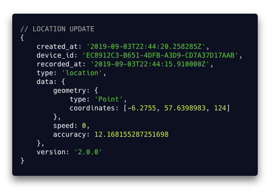
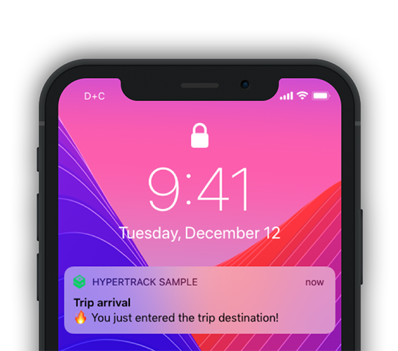

<a href="https://www.hypertrack.com/">
    
</a>

# Sample Backend Integration


A sample NodeJS/ExpressJS server integration with the HyperTrack platform. It consumes the HyperTrack APIs and Webhooks and exposes them through REST API endpoints, Socket.io streams, and push notifications for front-end or mobile application usage.

## Overview

- [Sample Backend Integration](#sample-backend-integration)
  - [Overview](#overview)
  - [Features](#features)
  - [Possibilities](#possibilities)
  - [How it works](#how-it-works)
  - [Requirements](#requirements)
  - [Installation and setup](#installation-and-setup)
    - [Local setup](#local-setup)
    - [Heroku setup](#heroku-setup)
  - [Usage](#usage)
    - [REST API Endpoints](#rest-api-endpoints)
    - [Webhooks](#webhooks)
    - [Websockets](#websockets)
    - [Push Notifications](#push-notifications)
  - [Related](#related)
  - [Credits](#credits)
  - [License](#license)

## Features

- One-click deploy to Heroku (using ONLY free add-ons)
- Synchronize all existing devices and trips on startup
- Receive webhooks and test locally with [Localtunnel](https://github.com/localtunnel/localtunnel)
- Store devices, trips, and all webhook records in MongoDB with Mongoose
- Auto-complete trips 2 minutes after destination arrival
- Notify Websocket subscribers on webhook arrival using Socket.io
- Send mobile device push notifications to Google's GCM and Apple's APN on webhook arrival
- Set home and work places for devices (relevant for Placeline apps)

## Possibilities

With the capability of this project, you can build web or mobile apps like Placeline:

<p align="center">
  
</p>

Examples of potential features include:

- Track all devices associated with your HyperTrack account on a world map with updates as they come in
- Map all active trips with start/end places and geofences
- Display all completed trips on a Placeline (time/location/activity series) and review relevant ones in more detail
- Create expense reports with pre-filled fields such as distance traveled, travel date/time, expenses based on distance and rate, and description based on start and end places

## How it works

The project uses the Model-Routes-Controllers pattern ([read more](https://developer.mozilla.org/en-US/docs/Learn/Server-side/Express_Nodejs/routes)) as the project structure. With that, the project structure looks like this:

- **/common**: Common functionality for HyperTrack API usage
- **/controllers**: Handlers for all routes
- **/models**: Mongoose Schema definitions for all relevant entities
- **/routes**: Definition of available REST API endpoints
- **index.js**: Main entry point for ExpressJS, setup of the server (Socket.io, CORS, Mongoose), and sync of devices and trips through the HyperTrack API

Once started, the project will collect and store all available devices and trips from the HyperTrack API. The Mongoose setup will ensure that missing collection definitions will be created. Once that is complete, the server will listen to HyperTrack Webhooks to come in. Every Webhook will create or update records in the database and execute related tasks (e.g. complete a trip from a trip completion webhook). Finally, Webhooks will be channeled to Websocket subscribers (if any) or to mobile apps using Push Notifications. The server will expose REST API endpoints in CRUD fashion for all available entities (trips, devices, etc).

> _Note_: For the sake of simplicity, the Socket.io and REST API endpoints **do not** enforce any auth mechanisms. Before going into production, ensure to secure your server communication.

## Requirements

The goal of this project is to get you to a deployed integration in minutes. For this to work, you need to have:

- [ ] Set up a [HyperTrack account](https://dashboard.hypertrack.com/signup) and obtain your `AccountId` and `SecretKey` from the [Dashboard](https://dashboard.hypertrack.com/)
- [ ] Integrate the HyperTrack SDK in your mobile application ([iOS](https://github.com/hypertrack/quickstart-ios), [Android](https://github.com/hypertrack/quickstart-android), or [React Native](https://github.com/hypertrack/quickstart-react-native)) or use our sample app to send location data ([iOS](https://github.com/hypertrack/live-app-ios) or [Android](https://github.com/hypertrack/live-app-android))
- [ ] Set up a [Heroku account](https://signup.heroku.com/) for deployment
- [ ] (Optional) For mobile device Push Notifications: [Firebase Cloud Messaging key](https://github.com/hypertrack/quickstart-android#enable-server-to-device-communication), [APN Key ID](https://developer.apple.com/documentation/usernotifications/setting_up_a_remote_notification_server/establishing_a_token-based_connection_to_apns), [APN authentication token signing key](https://developer.apple.com/documentation/usernotifications/setting_up_a_remote_notification_server/establishing_a_token-based_connection_to_apns), and [Apple Developer Account Team ID](https://www.mobiloud.com/help/knowledge-base/ios-app-transfer/)

## Installation and setup

You can install this project on your local machine and deploy it quickly to Heroku for free.

### Local setup

After cloning or forking this repository, you should install all dependencies on your machine:

```shell
# with npm
npm install

# or with Yarn
yarn
```

Next, you need to set your environmental variables. The project uses [dotenv](https://github.com/motdotla/dotenv), so it's best to create a `.env` file in the root folder of the project. This file is listed in `.gitignore` and shall not be checked into public repositories. Below is the content on the file - please ensure to replace the keys with your own:

```shell
# HyperTrack
HT_ACCOUNT_ID = <YOUR_ACCOUNT_ID>
HT_SECRET_KEY = <YOUR_SECRET_KEY>

# MongoDB
MONGODB_URI = <YOUR_MONGODB_URI>

# Optional - Push Notifications
APN_CERT="<YOUR_APN_TOKEN_IN_P8>"
APN_KEY_ID=<YOUR_APN_TOKEN_KEY_ID>
APN_TEAM_ID=<YOUR_TEAM_ID>
FCM_KEY=<YOUR_FCM_KEY>
```

With the dependencies and configuration in place, you can start the server in development mode:

```shell
# with npm
npm run dev

# or with Yarn
yarn dev
```

On startup, Localtunnel is used to generate a publicly accessible URL for your local server (`https://<unqiue_id>.localtunnel.me`). A new browser window will open with your unique, temporary domain. If successful, the browser window should show:

```text
HyperTrack Placeline Backend is RUNNING
```

**Congratulations!** You just completed the integration with HyperTrack APIs and Webhooks.

### Heroku setup

This project is set up to be deployed to Heroku within seconds. You need a Heroku account. All you need to do is to click on the one-click-deploy button below. It will provide the following services and add-ons:

- Web Dyno - to run the server on Heroku (free)
- NodeJS buildpack - to run NodeJS/ExpressJS on Heroku (free)
- MongoLab - hosted MongoDB database (free)
- PaperTrail - hosted logging system (free)

Similar to the local setup, you need to have your keys ready before the deployment. The Heroku page will ask you for the following:

- `HT_ACCOUNT_ID`: Your HyperTrack AccountId from the [HyperTrack Dashboard](https://dashboard.hypertrack.com/setup)
- `HT_SECRET_KEY`: Your HyperTrack SecretKey from the [HyperTrack Dashboard](https://dashboard.hypertrack.com/setup)
- `FCM_KEY`: Push Notifications (optional): Your Firebase Cloud Messaging Key. [Read more here](https://github.com/hypertrack/quickstart-android#enable-server-to-device-communication)
- `APN_KEY_ID`: Push Notifications (optional): Your Apple Push Notification (APN) Key ID. [Read more here](https://developer.apple.com/documentation/usernotifications/setting_up_a_remote_notification_server/establishing_a_token-based_connection_to_apns)
- `APN_CERT`: Push Notifications (optional): Your Apple Push Notification (APN) authentication token signing key. Paste \*.p8 file contents in the field. [Read more here](https://developer.apple.com/documentation/usernotifications/setting_up_a_remote_notification_server/establishing_a_token-based_connection_to_apns)
- `APN_TEAM_ID`: Push Notifications (optional): Your Apple Developer Account Team ID. [Read more here](https://www.mobiloud.com/help/knowledge-base/ios-app-transfer/)

> _Note_: For `APN_CERT`, you have to use multiline variables (replace all newlines with `\n` and double quotes around the string). [Read more here](https://stackoverflow.com/a/46161404)

You need to enter all of these keys for the project to run successfully. Heroku uses the input to pre-set the environmental variables for the deployment. You can change after the setup as well.

**Deploy this project now on Heroku:**

[](https://heroku.com/deploy?template=https://github.com/hypertrack/backend-nodejs)

## Usage

The project exposes all devices and trip data through a variety of interfaces. Below is an explanation of each interface, setup steps, and usage details.

### REST API Endpoints

ExpressJS exposes API endpoints based on the routes defined in the _/route_ folder. Here is a breakdown of available routes, methods, and use cases.

> _Note_: All the endpoints below respond with data from the MongoDB database, not directly from the HyperTrack API.

| Route                              | Methods     | Use Cases                                                                                          |
| ---------------------------------- | ----------- | -------------------------------------------------------------------------------------------------- |
| /                                  | GET         | Status checking endpoint, returns plain text message                                               |
|                                    |
| /devices                           | GET         | Get all tracked [devices](https://docs.hypertrack.com/#api-devices)                                |
| /devices/{device_id}               | GET, DELETE | Get/delete device by device ID                                                                     |
| /devices/{device_id}/trips         | GET         | Get all [trips](https://docs.hypertrack.com/#api-trips) for specific device                        |
| /trips                             | GET, POST   | Get all or create new trip                                                                         |
| /trips/{trip_id}                   | GET, POST   | Get/update a trip by trip ID                                                                       |
| /device-places                     | GET         | Get all places for all devices                                                                     |
| /device-places/{device_id}         | GET         | Get all places for specific device                                                                 |
| /device-places/{device_id}/{label} | GET, POST   | Get/set specific place (by label) for specific device                                              |
|                                    |
| /device-status                     | GET, POST   | Get all or save new [device status update](https://docs.hypertrack.com/#device-status-payload)     |
| /device-status/{device_id}         | GET         | Get all device status updates for specific device                                                  |
| /device-status/{device_id}/last    | GET         | Get last device status update for specific device                                                  |
| /battery-status                    | GET, POST   | Get all or save new [battery status update](https://docs.hypertrack.com/#battery-payload)          |
| /battery-status/{device_id}        | GET         | Get all battery status updates for specific device                                                 |
| /battery-status/{device_id}/last   | GET         | Get last battery status update for specific device                                                 |
| /locations                         | GET, POST   | Get all or save new [location update](https://docs.hypertrack.com/#location-payload)               |
| /locations/{device_id}             | GET         | Get all location updates for specific device                                                       |
| /locations/{device_id}/last        | GET         | Get last location update for specific device                                                       |
| /trip-status                       | GET, POST   | Get all or save new [trip status update](https://docs.hypertrack.com/#trip-payload)                |
| /trip-status/{device_id}           | GET         | Get all trip status updates for specific trip                                                      |
| /trip-status/{device_id}/last      | GET         | Get last trip status update for specific trip                                                      |
|                                    |
| /device-push-info                  | GET         | Get all device push information (including token, platform, package name)                          |
| /device-push-info/{device_id}      | GET, DELETE | Get/delete device push information by device ID                                                    |
| /push-notifications                | POST        | Create a new push notification record                                                              |
|                                    |
| /hypertrack                        | POST        | Endpoint to receive [HyperTrack Webhooks](https://docs.hypertrack.com/#webhooks). Read more below. |

### Webhooks

<p align="center">
  
</p>

With the deployment of this project, you will have an endpoint listening to incoming webhooks. Depending on the deployment (local/Heroku/etc), your domain will change, but the available Webhook endpoint will end with `/hypertrack`. Here are samples of the full webhook URL that you will have to enter on the HyperTrack Dashboard:

- Heroku: `https://<heroku_app_name>.herokuapp.com/hypertrack`
- Localtunnel: `https://<alias>.localtunnel.me/hypertrack` (alias can be configured in the package.json)

All webhooks will be processed and stored to the MongoDB. Some updates might update other database records (e.g. battery status update reflected in device records). It is important to note that `destination_arrival` [trip webhooks](https://docs.hypertrack.com/#trip-payload) will trigger [trip completion API calls](https://docs.hypertrack.com/#complete-trip) two minutes after the webhook arrival. You can change this behavior by modifying the `routes/webhook.route.js` file.

> _Note_: You can look into the console logs to review all received webhooks. This also allows you to run through the one-time verification for HyperTrack Webhooks.

### Websockets

The project uses [socket.io](https://github.com/socketio/socket.io) as ExpressJS middleware. A connection is opened by default when the project is started up.

> _Note_: The connection is unsecured by default. It's highly recommended to add an auth layer before going to production.

With this middleware, the `io` instance is attached to every handler in the response object. This is used in the `/hypertrack` webhook handler to notify subscribed clients. Events are being emitted using the [webhook type](https://docs.hypertrack.com/#webhook) as event name (one of `location`, `device_status`, `battery` or `trip`) and the entire webhook payload as event payload.

To subscribe to events triggered by webhooks, you can use the [socket.io-client](https://github.com/socketio/socket.io-client) project. You will need the server URL to connect appropriately. It is recommended to update the package.json configuration for the `dev` script to set a unqiue Localtunnel URL when testing locally): `lt --subdomain <alias> --port 8080 --open`. Here's a sample socket subscription:

```html
<script src="/socket.io/socket.io.js"></script>
<script>
  var socket = io(<SERVER_URL>);
  socket.on('connect', function(){
      console.log("Connected to server ...")
  });
  // listen to one of: location, device_status, battery or trip
  socket.on('location', function(data){
      console.log("Location data received: ", data)
  });
  socket.on('disconnect', function(){
      console.log("Disconnected from server ...")
  });
</script>
```

### Push Notifications

<p align="center">
  
</p>

The project is capable of sending mobile push notifications triggered by webhooks from HyperTrack. By default, notifications are pushed only for the trip updates: `destination_arrival` and `geofence_enter`.

> _Note_: Push attempts will only be made when required environment variables are defined. [Read more here](#installation-and-setup)

Keep in mind that for push notifications to work properly, you have to manage push notification information (token, platform, package name associated with device ID) in your systems. To obtain this information, your mobile application has to be enabled for push notifications, store the push information, and make it accessible to this project.

Whenever one of the two relevant updates are received, the device ID is used to look up required push notification information. With a successful lookup, a new database record for the push notification attempt is created. Finally, the push notification is sent to the device [through Firebase Cloud Messaging (FCM)](https://firebase.google.com/docs/cloud-messaging).

The notification payload is generated by the package [node-pushnotifications](https://github.com/appfeel/node-pushnotifications) based on the platform it identifies for the devices. Below are payload previews for iOS and Android.

<details><summary>iOS - Destination arrival</summary><p>

```json
{
  "priority": 5,
  "topic": "<pushInfo.app_name>",
  "alert": {
    "title": "Trip arrival",
    "body": "🔥 You just entered the trip destination!"
  },
  "contentAvailable": true,
  "payload": {
    "placeline": {
      "status": "destination_arrival",
      "trip": {
        "id": "<trip_id>",
        "metadata": "<trip_metadata>"
      }
    }
  }
}
```

</p>
</details>

<details><summary>Android - Destination arrival</summary><p>

```json
{
  "priority": "normal",
  "notification": {
    "title": "Trip arrival",
    "body": "🔥 You just entered the trip destination!"
  },
  "contentAvailable": true,
  "data": {
    "title": "Trip arrival",
    "body": "🔥 You just entered the trip destination!",
    "placeline": {
      "status": "destination_arrival",
      "trip": {
        "id": "<trip_id>",
        "metadata": "<trip_metadata>"
      }
    }
  }
}
```

</p>
</details>

<details><summary>iOS - Geofence enter</summary><p>

```json
{
  "priority": 5,
  "topic": "<pushInfo.app_name>",
  "alert": {
    "title": "Trip geofence enter",
    "body": "🔥 You just entered the trip geofence for <place_name>"
  },
  "contentAvailable": true,
  "payload": {
    "placeline": {
      "status": "geofence_enter",
      "trip": {
        "id": "<trip_id>",
        "metadata": "<trip_metadata>"
      },
      "geofence": {
        "metadata": "<geofence_metadata>"
      }
    }
  }
}
```

</p>
</details>

<details><summary>Android - Geofence enter</summary><p>

```json
{
  "priority": "normal",
  "notification": {
    "title": "Trip geofence enter",
    "body": "🔥 You just entered the trip geofence for <place_name>"
  },
  "contentAvailable": true,
  "data": {
    "title": "Trip geofence enter",
    "body": "🔥 You just entered the trip geofence for <place_name>",
    "placeline": {
      "status": "geofence_enter",
      "trip": {
        "id": "<trip_id>",
        "metadata": "<trip_metadata>"
      },
      "geofence": {
        "metadata": "<geofence_metadata>"
      }
    }
  }
}
```

</p>
</details>

## Related

This backend integration is built to be work seamlessly with the [Placeline web app](https://github.com/hypertrack/placeline-nextjs) and the [Placeline scheduler](https://github.com/hypertrack/sample-scheduler-rabbitmq).

## Credits

This project uses the following open-source packages:

- [body-parser](https://github.com/expressjs/body-parser): Node.js body parsing middleware
- [cors](https://expressjs.com/en/resources/middleware/cors.html): Node.js CORS middleware
- [dotenv](https://github.com/motdotla/dotenv): Load environment variables from .env files
- [express](https://expressjs.com/): Web framework for Node.js
- [localtunnel](https://github.com/localtunnel/localtunnel): Expose your localhost to the world for testing and sharing
- [mongoose](https://mongoosejs.com/): Mongodb object modeling for node.js
- [node-pushnotifications](https://github.com/appfeel/node-pushnotifications): Push notifications for GCM, APNS, MPNS, AMZ
- [nodemon](https://github.com/remy/nodemon): Monitor for any changes in your node.js application and automatically restart the server
- [request](https://github.com/request/request): Simplified HTTP client
- [socket.io](https://github.com/socketio/socket.io): Realtime application framework

## License

This project is licensed under the MIT License - see the [LICENSE](LICENSE) file for details
